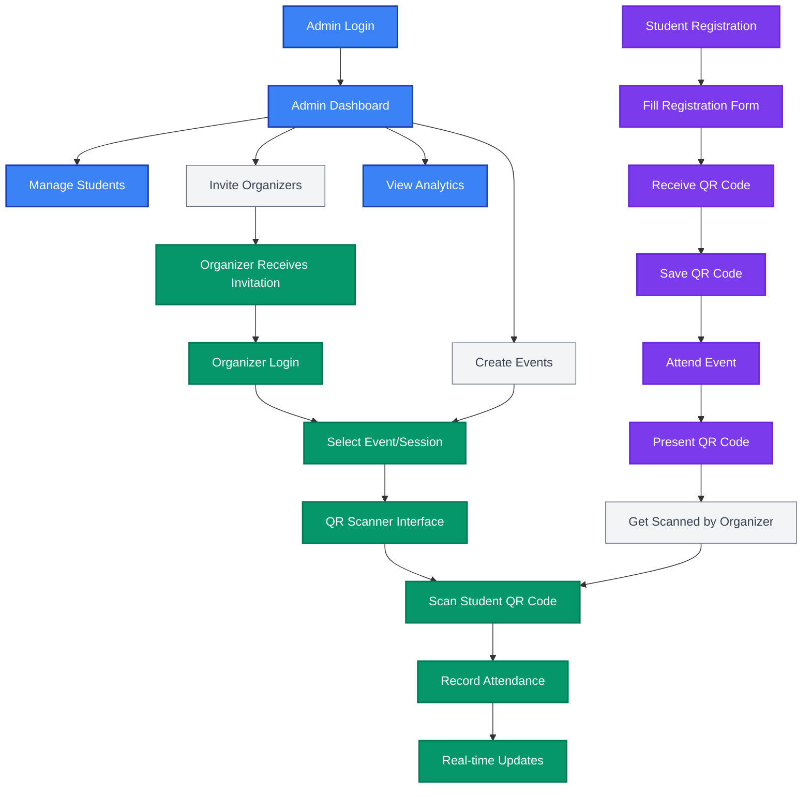

# DTP Go - Hybrid Student Registration System

DTP Go is a comprehensive attendance tracking and student registration system built with Next.js 15, TypeScript, and Tailwind CSS. **We solve the problem of long queues during events and eliminate manual report generation** through our innovative QR code-based system that enables instant student registration and lightning-fast attendance scanning.

## 🎯 Project Overview

**Main Purpose**: DTP Go eliminates event queues and automates report generation through instant QR code-based attendance tracking

**Problem Solved**: 
- **🚫 No More Long Queues**: Students register once and receive permanent QR codes, eliminating repetitive registration lines
- **⚡ Lightning-Fast Scanning**: Organizers scan QR codes in seconds instead of manual roll calls
- **📊 Automated Reports**: Real-time analytics and instant CSV exports replace manual report generation
- **🎯 One-Time Registration**: Students register once and use their QR code for all future events

**Target Audience**: 
- **Administrators**: Manage students, events, organizers, and view analytics
- **Organizers**: Scan student QR codes for attendance tracking at events
- **Students**: Register once to receive a permanent QR code that works for all future events

### 📱 Application Screenshots

*Screenshots and GIFs showcasing the different user interfaces:*

#### Admin Dashboard


#### Organizer Scanning Interface

*Placeholder: Add your QR scanning GIF to `./docs/screenshots/organizer-scanning.gif`*

#### Student Registration


#### QR Code Display


## ✨ Core Features

### 🚀 **Queue Elimination & Speed**
- **One-Time Student Registration**: Students register once and receive a permanent QR code for all future events
- **Instant QR Code Generation**: Immediate QR code creation upon registration
- **Lightning-Fast QR Scanning**: Organizers scan QR codes in under 2 seconds using device cameras
- **No More Manual Roll Calls**: Replace time-consuming manual attendance with instant scanning

### 📊 **Automated Reporting**
- **Real-time Analytics Dashboard**: Live registration metrics and attendance statistics
- **Instant CSV Exports**: Generate attendance reports in seconds, not hours
- **Automated Report Generation**: Eliminate manual data compilation and report creation
- **Live Attendance Tracking**: Real-time updates during events

### 🛠️ **System Management**
- **Dual Registration Workflows**: Admin dashboard and public self-registration
- **Event & Session Management**: Create events with multiple attendance sessions and time windows
- **Organizer Management**: Invite and assign organizers to specific events
- **Role-based Authentication**: Secure Supabase Auth with Admin/Organizer permissions

## 🛠️ Technology Stack

- **Frontend**: Next.js 15 (App Router), React 19, TypeScript 5
- **Styling**: Tailwind CSS 4, shadcn/ui components, Lucide React icons
- **Database**: Neon PostgreSQL with Prisma ORM
- **Authentication**: NextAuth.js credentials authentication with role-based access control
- **QR Code**: qrcode library for generation, html5-qrcode for scanning
- **Organizer Invitations**: Manually shared, time-limited invitation links
- **Validation**: Zod schemas for data validation

## 📋 Prerequisites

- Node.js 18+ and pnpm package manager
- Neon account and PostgreSQL database
- PostgreSQL database access
- Camera access for QR scanning functionality

## 🚀 Quick Start

### Environment Setup

Create a `.env.local` file in your project root:

```env
# =============================================================================
# DATABASE CONFIGURATION
# =============================================================================
# PostgreSQL Database Connection String
# Neon pooled connection string for application queries
DATABASE_URL=

# =============================================================================
# DATABASE MIGRATIONS
# =============================================================================
# Neon direct connection string for Prisma schema operations
DIRECT_URL=

# NextAuth configuration
NEXTAUTH_URL=http://localhost:3000
NEXTAUTH_SECRET=

# =============================================================================
# APPLICATION CONFIGURATION
# =============================================================================
NEXT_PUBLIC_APP_URL=http://localhost:3000

# Used by `pnpm exec prisma db seed`
ADMIN_EMAIL=
ADMIN_PASSWORD=
```

### Installation & Setup

1. **Install dependencies**:
   ```bash
   pnpm install
   ```

2. **Set up database**:
   ```bash
   # Generate Prisma client
   pnpm db:generate
   
   # Apply database migrations
   pnpm db:migrate
   ```

3. **Create the admin user**:
   - Set `ADMIN_EMAIL` and `ADMIN_PASSWORD` in `.env.local`
   - Run `pnpm exec prisma db seed`

4. **Start development server**:
   ```bash
   pnpm dev
   ```

5. **Open your browser**: [http://localhost:3000](http://localhost:3000)

## 📖 Basic Usage

### For Administrators
- Login at `/auth/login` → Access admin dashboard
- Manage students, events, and organizers
- View analytics and registration statistics

### For Organizers
- Login → Select event/session
- Scan student QR codes for attendance tracking
- Real-time attendance recording

### For Students
- Register once at `/join` → Receive permanent QR code
- Present QR code at any future event for attendance
- No need to re-register for each event

## 🔄 User Flow Diagram



## 📁 Project Structure

```
src/
├── app/                 # Next.js App Router
│   ├── admin/          # Admin dashboard pages
│   ├── organizer/      # Organizer scanning interface
│   ├── join/           # Public student registration
│   └── api/            # API routes
├── components/         # React components
│   ├── admin/          # Admin-specific components
│   ├── organizer/      # Organizer-specific components
│   └── ui/             # Reusable UI components
├── lib/                # Utilities and configurations
│   ├── auth/           # Authentication logic
│   ├── db/             # Database queries
│   ├── qr/             # QR code generation
│   └── scanning/       # QR scanning logic
└── prisma/             # Database schema
```

## 🛠️ Available Scripts

```bash
# Development
pnpm dev                # Start development server
pnpm build              # Build for production
pnpm start              # Start production server
pnpm lint               # Run ESLint

# Database Management
pnpm db:generate        # Generate Prisma client
pnpm db:migrate         # Run database migrations
pnpm db:studio          # Open Prisma Studio
pnpm db:reset           # Reset database

# Testing
pnpm test               # Run tests
pnpm test:watch         # Run tests in watch mode
pnpm test:coverage      # Run tests with coverage
```

## 🚀 Deployment

### Recommended Platform
- **Vercel**: Optimized for Next.js applications
- **Database**: Supabase PostgreSQL
- **Environment**: Set all required environment variables in deployment platform

### Deployment Steps
1. Connect your repository to Vercel
2. Configure environment variables
3. Deploy automatically on push to main branch

## 🤝 Contributing

- **Repository**: GitHub-based development
- **Issues**: Report bugs and feature requests through GitHub Issues
- **Documentation**: Comprehensive PRDs and task lists in `/docs` folder

## 📞 Support

For support and questions:
- Create an issue in the GitHub repository
- Check the documentation in the `/docs` folder
- Review the comprehensive PRDs for feature details

---

Built with ❤️ using Next.js 15, TypeScript, and Tailwind CSS
